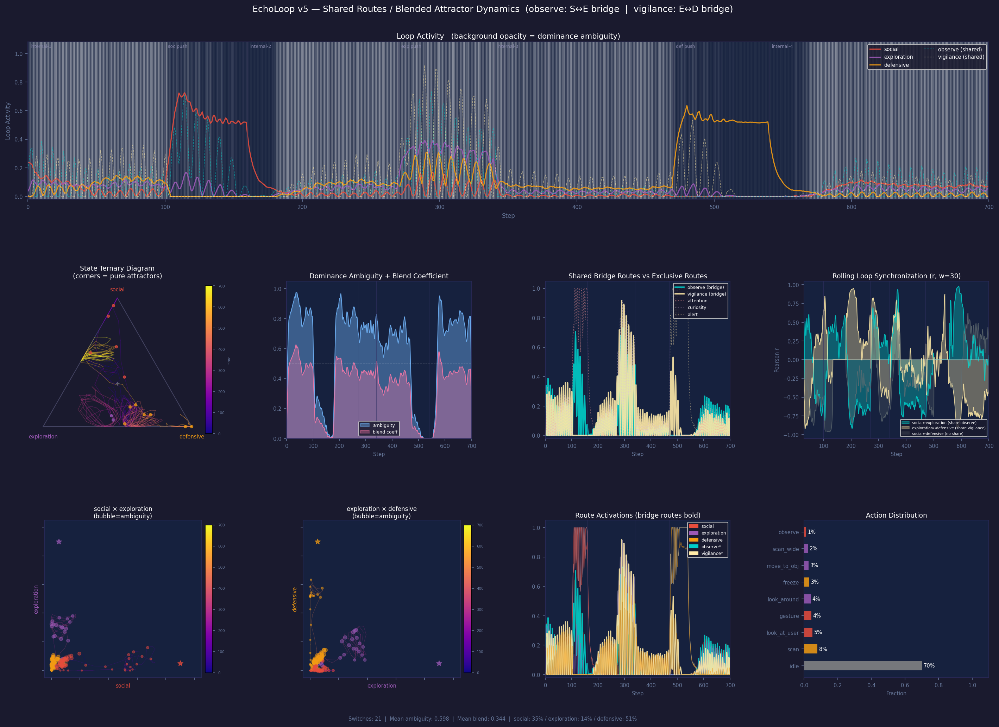

# EchoLoop

**Can shared intermediate routes destabilize otherwise stable recurrent loops?**

EchoLoop is a toy simulation exploring that question. Three recurrent activation loops compete over a shared graph. When loops have private nodes, one tends to win and hold dominance. When loops share intermediate nodes, dominance becomes unstable — switching is frequent, blended states persist, and no single loop holds control for long.

The loop names (Social, Exploration, Defensive) are just labels for recurring activation cycles. The behavior does not come from those labels. It comes from topology: whether a node is private to one loop or shared between multiple loops.

---

## How It Works

Three loops compete by activating nodes and inhibiting each other. Each step, activation flows forward through edges, accumulates fatigue on active edges, and is cross-inhibited by other loops. There is no global reward and no explicit switching rule.

```
social (4-cycle):      attention → observe → engage → approach → …
                                     ↑ bridge ↓
exploration (5-cycle): curiosity → observe → wander → vigilance → inspect → …
                                                         ↑ bridge ↓
defensive (4-cycle):   alert → vigilance → freeze → withdraw → …
```

Two nodes — `observe` and `vigilance` — are shared between loops. A loop using a shared node is visible to, and can be disrupted by, the loops on the other side.

| Shared node | Connects |
|---|---|
| `observe` | Social ↔ Exploration |
| `vigilance` | Exploration ↔ Defensive |

---

## Key Observation: Separated Loops vs. Shared Routes

| v3 — fully separated loops | v5 — shared bridge routes |
|:---:|:---:|
|  |  |
| One loop dominates at a time in wide, stable blocks. | Switching is frequent. No loop holds dominance for long. |

*Solid lines = loop activation strength. Dashed lines = shared bridge routes. Background shading = steps where no loop clearly dominates.*

In v3, each loop has its own private nodes. Once a loop wins, it tends to stay dominant — winner-take-all behavior with rare, block-like transitions. In v5, two bridge nodes are shared between adjacent loops. Any loop using a bridge node is exposed to interference from the loops on either side, and dominance becomes much harder to sustain.

The route topology is what changes the behavior. Adding shared nodes did not require programming a new switching rule — the instability appears to arise from the structure of the graph and the local update dynamics.

| Metric | v3 | v5 |
|---|---|---|
| Loop switches per run | 2 | **21** |
| Mean dominance ambiguity | low (qualitative) | **0.60** |
| Exploration mean dwell | long block-like periods | **9.5 steps** |
| Social mean dwell | long block-like periods | 61 steps |
| Defensive mean dwell | long block-like periods | 45 steps |

The Exploration loop is flanked by both bridge nodes — disrupted by Social on one side and Defensive on the other. It became the least stable of the three, with a mean dwell roughly 6–7× shorter than the others.

### Blended state


*Each dot is one timestep. Position encodes relative loop dominance: corners = one loop fully dominant, center = all three roughly equal. v5 spends most of its time away from the corners.*

---

## Observed Behaviors

Depending on parameters and random seed:

- spontaneous loop switching without an explicit switching rule
- persistent blended states where no loop clearly dominates
- activation spikes on bridge nodes when two loops compete for them simultaneously
- high idle rate (~70% in v5) when split activation leaves no node above threshold
- fatigue-driven recovery and oscillation

---

## Version History

| Version | Core change | Switches/run |
|---|---|---|
| v1 | Route graph + Hebbian-style updates | — |
| v2 | Single limit cycle | 0 |
| v3 | 3-loop competition, fully separated | 2 |
| v4 | Fatigue added to edges | 4 |
| v5 | Shared bridge routes (`observe`, `vigilance`) | 21 |

---

## Running

```bash
python3 scripts/echoloop5.py
```

Saves output to `images/`. Full diagnostic dashboard:

[](./images/echoloop_v5_dashboard.png)

---

## Relation to Prior Work

EchoLoop loosely resembles ideas already explored in other fields:

- **Stigmergy / trail reinforcement** — paths strengthen or weaken through use, similar to how shared routes here accumulate fatigue and alter loop dynamics
- **Agent-based modeling** — local update rules producing global patterns without a central controller
- **Attractor dynamics** — loops pull the system toward recurring states; fatigue and shared interference destabilize those attractors

These are loose references, not claims of formal equivalence. EchoLoop does not propose a new framework within any of these fields. It is a small sandbox for observing what route topology does to loop competition.

---

## Possible Directions

- vary bridge node membership weights and observe the effect on ambiguity
- add a third bridge connecting Social ↔ Defensive directly
- add asymmetric fatigue recovery rates between loops
- let topology evolve over time (route pruning and growth)

---

## What this project does and does not claim

### What EchoLoop does

- Provides a minimal toy model for observing how network topology changes under survival-only selection
- Demonstrates that removing a static readout layer exposes a hidden dependency on behavioral diversity mechanisms
- Shows that exploration noise and sleep-like consolidation can partially substitute for a static readout in a small-scale setting (N=20)
- Reports reproducible structural differences between readout-based and embodied-output architectures (10 seeds, 3 criteria ≥8/10)

### What EchoLoop does NOT claim

- That reward-free value emergence has been proven
- That the observed recurrent structures perform meaningful computation
- That results scale beyond N=20
- That this is a theory of intelligence, consciousness, or biological cognition
- That EchoLoop outperforms established neuroevolution methods (NEAT etc.)
- That context-dependent routing has been achieved

### Current status

Preliminary research snapshot.
Independent replication encouraged.
Hyperparameter sensitivity and scaling experiments are planned but not yet completed.

---

## Quick Start

```bash
# Install dependencies
pip install numpy networkx matplotlib scipy

# Run Session 12 (sleep consolidation)
cd experiments/co_evolution_sim
python session_12_sleep_consolidation.py

# Run Session 14 (reproducibility check)
python session_14_reproducibility.py
```

---

## Project Structure

```
echoloop/
├── scripts/                          # Core EchoLoop scripts (v1–v5)
│   ├── echoloop.py                   # v1: initial route graph
│   ├── echoloop2.py                  # v2: single limit cycle
│   ├── echoloop3.py                  # v3: 3-loop competition
│   ├── echoloop4.py                  # v4: fatigue
│   └── echoloop5.py                  # v5: shared bridge routes
├── experiments/
│   └── co_evolution_sim/             # Embodied neuroevolution (Sessions 3–14)
│       ├── session_10_embodied_output.py    # Output node architecture
│       ├── session_11_noise_escape.py       # Exploratory noise
│       ├── session_12_sleep_consolidation.py # Sleep-like consolidation
│       ├── session_13_anatomy.py            # Structural analysis
│       ├── session_14_reproducibility.py    # 10-seed reproducibility
│       ├── images/                   # Generated figures
│       └── results_s14_raw.csv       # Raw reproducibility data
├── images/                           # EchoLoop v1–v5 figures
└── results/                          # Results summaries
```

---

## Key Findings (preliminary)

Removing the readout layer from a survival-only agent:
1. Collapsed behavioral diversity → local optima
2. Exploratory noise restored diversity but prevented stable inheritance
3. Sleep-like consolidation resolved this tension
4. Survivors show 7–18 hop input-to-output paths vs 1–5 hops in readout-based agents (9/10 seeds)
5. Ablation sensitivity differs between survivors and non-survivors (8/10 seeds)

Static readouts can hide the problem of behavioral diversity in embodied agents; when removed, exploration and consolidation dynamics become necessary for stable adaptive behavior.

---

## Citation

If you reference this work, please cite:

[Your Name] (2026). EchoLoop: Embodied Neuroevolution Without a Readout Layer (v0.1.0).
Zenodo. https://doi.org/[TBD]

---

## License

MIT
