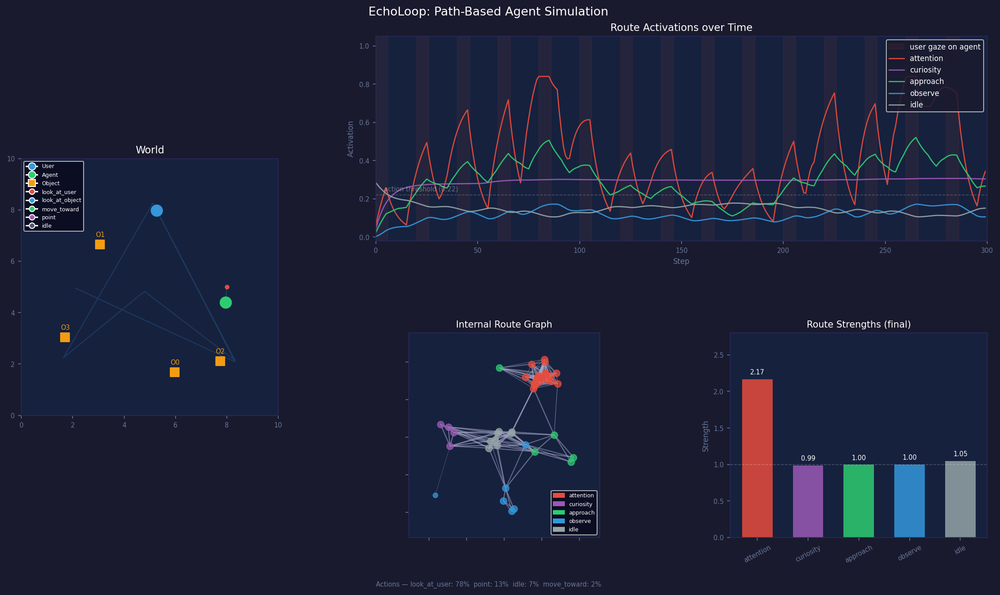

# EchoLoop

経路が本体のエージェントシミュレーション。

## 仮説

> ニューラルネットではなく「経路」がエージェントの主体である。  
> 外界入力は内部循環ルートを歪めるだけ。行動は内部状態の読み出しとして発火する。

## デモ



- **左**: 2D ワールド。ユーザー (青) とエージェント (緑) の軌跡、アクション種別を色付きドットで表示
- **右上**: 300 step のルート activation 推移。赤シェード = ユーザーがエージェントを見ているフェーズ
- **右下左**: 内部ノード/エッジグラフ。edge.strength を線の濃さで表現
- **右下右**: 最終ルート strength (= 学習済み経路の強さ)

## 構造

```
User ──gaze / reaction──▶ Agent
                            │
              ┌─────────────┼─────────────┐
              ▼             ▼             ▼
          attention      curiosity     approach    observe    idle
              │             │
              └──── route-to-route interactions ────┘
                            │
                     Node / Edge Graph
                    (構造的学習レイヤ)
```

### ルート一覧

| ルート | アクション | 主な入力源 |
|---|---|---|
| `attention` | `look_at_user` | ユーザーの視線がエージェントに向いている |
| `curiosity` | `point` | 周囲のオブジェクトの interest 総和 |
| `approach` | `move_toward` | ユーザーが近くにいて reaction が正 |
| `observe` | `look_at_object` | attention / curiosity からの流入 |
| `idle` | `idle` | 常時ベースライン |

### ノード生成ルール

- **80%**: よく使われる edge 周辺に生成 (探索効率重視)
- **20%**: 完全ランダム生成 (局所最適回避)

## 実行

```bash
pip install numpy matplotlib
python echoloop.py
```

`echoloop_result.png` に可視化結果を保存し、ウィンドウ表示する。

## 結果例 (seed=42, 300 steps)

| ルート | 最終 activation | 最終 strength |
|---|---|---|
| `attention` | 0.342 | **2.17** ← 強化された |
| `curiosity` | 0.304 | 0.99 |
| `approach` | 0.266 | 1.00 |
| `observe` | 0.106 | 1.00 |
| `idle` | 0.151 | 1.05 |

アクション分布: `look_at_user` 78% / `point` 13% / `idle` 7% / `move_toward` 2%

`attention` の strength が 2.17 まで成長しているのは、  
ユーザーに注目されるたびに正の reaction で強化されたため。  
「よく通る経路が優先される」という仮説の動作が数値で確認できる。

詳細は [RESULTS.md](RESULTS.md) を参照。
