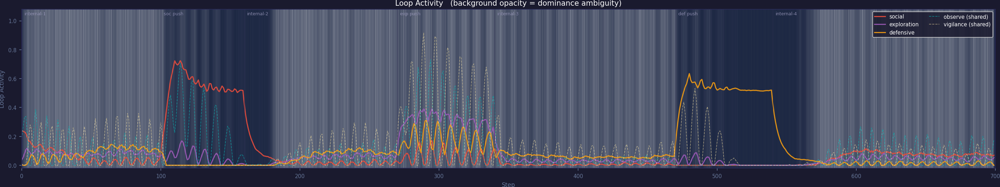
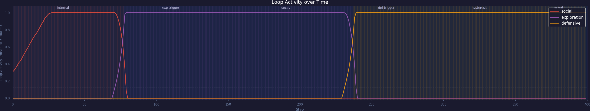
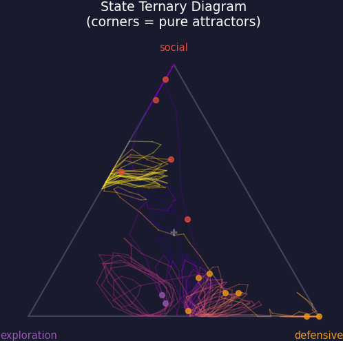

# EchoLoop

A toy simulation of three recurrent loops competing through shared route nodes.



*Solid lines show each loop's activation strength over time. Dashed lines are the two shared bridge routes. The frequent switching and background shading in v5 are what this project is about.*

---

## What This Is

EchoLoop is a small experimental sandbox. Three named loops — Social, Exploration, and Defensive — share an activation graph. Some nodes belong to more than one loop. You run the simulation and watch what happens.

It is not a neuroscience model. It is not a claim of a new theory. It sits closer to agent-based modeling and attractor-dynamics toy problems than to anything production-grade.

The closest existing ideas are: stigmergy, trail reinforcement, agent-based modeling, and attractor-like dynamics.

---

## Model Structure

```
social (4-cycle):      attention → observe → engage → approach → …
                                     ↑ bridge ↓
exploration (5-cycle): curiosity → observe → wander → vigilance → inspect → …
                                                         ↑ bridge ↓
defensive (4-cycle):   alert → vigilance → freeze → withdraw → …
```

Two nodes — `observe` and `vigilance` — are shared between loops. When multiple loops compete for the same node, they interfere with each other.

| Shared node | Connects |
|---|---|
| `observe` | Social ↔ Exploration |
| `vigilance` | Exploration ↔ Defensive |

Each step, activation flows forward through edges, accumulates fatigue on active edges, and is cross-inhibited by competing loops. There is no global reward or explicit switching rule.

---

## Key Observation: Separate Loops vs. Shared Routes

Adding two shared bridge nodes changed the dynamics substantially.

| v3 — fully separated loops | v5 — shared bridge routes |
|:---:|:---:|
|  |  |
| One loop dominates at a time. Switching is rare and block-like. | Switching is frequent. No loop holds dominance for long. |

In v3, each loop has its own private nodes — once a loop wins, it stays dominant. In v5, two bridge nodes (`observe`, `vigilance`) are shared. Any loop using a bridge node is visible to, and disrupted by, the loops on the other side.

| Metric | v3 | v5 |
|---|---|---|
| Loop switches per run | 2 | **21** |
| Mean dominance ambiguity | low | **0.60** |
| Exploration mean dwell | long | **9.5 steps** |
| Social mean dwell | long | 61 steps |
| Defensive mean dwell | long | 45 steps |

The Exploration loop — flanked by both bridge nodes — became the least stable of the three. This behavior was not directly scripted as a switching rule; it appears to arise from the shared-route topology and update dynamics.

### What blended state looks like



*Each dot is one timestep, placed by relative loop strength. Corner = one loop fully dominant. Center = no clear winner. v5 spends most of its time away from any corner.*

---

## Observed Behaviors

Depending on parameters and random seed, the system exhibits:

- spontaneous loop switching
- persistent blended states (no loop clearly dominant)
- brief spikes on bridge nodes when two loops compete for them
- high idle rate (~70% in v5) when activation is split and no node clears threshold
- fatigue-driven recovery and oscillation

---

## Version History

| Version | Core change | Switches/run |
|---|---|---|
| v1 | Route graph + Hebbian-style updates | — |
| v2 | Single limit cycle | 0 |
| v3 | 3-loop competition, fully separated | 2 |
| v4 | Fatigue added to edges | 4 |
| v5 | Shared bridge routes (`observe`, `vigilance`) | 21 |

---

## Running

```bash
python3 scripts/echoloop5.py
```

Output is saved to `./images/echoloop_v5_dashboard.png` and contains loop activity, the ternary state diagram, bridge vs. exclusive route activations, rolling inter-loop correlation, and action distribution.

[View full diagnostic dashboard](./images/echoloop_v5_dashboard.png)

---

## Relation to Prior Work

This project touches ideas already explored elsewhere:

- **Stigmergy / trail reinforcement** — shared routes strengthen or weaken through use, similar to pheromone trails guiding path selection
- **Agent-based modeling** — local update rules produce global patterns without a central controller
- **Attractor dynamics** — loops pull the system toward recurring states; fatigue destabilizes them

EchoLoop does not propose a new framework within any of these fields. It borrows from all of them loosely, in a single-agent, single-process form. The intent is exploratory observation, not formal contribution.

---

## Possible Directions

- vary bridge node membership weights and measure ambiguity
- add a third bridge connecting Social ↔ Defensive
- add asymmetric fatigue recovery rates
- let topology change over time (route pruning / growth)

---

## License

MIT
